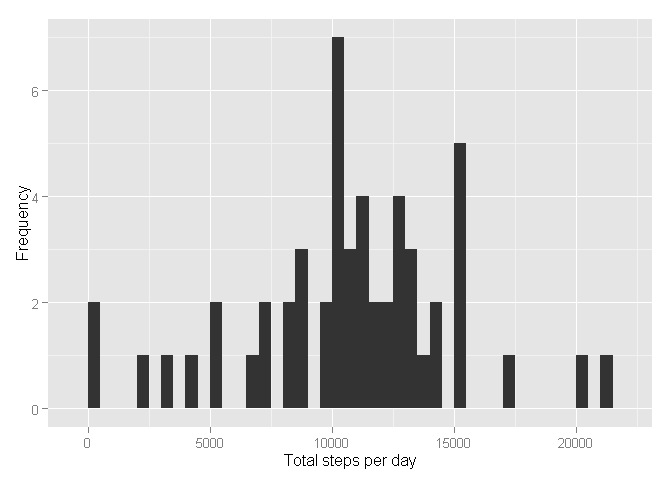
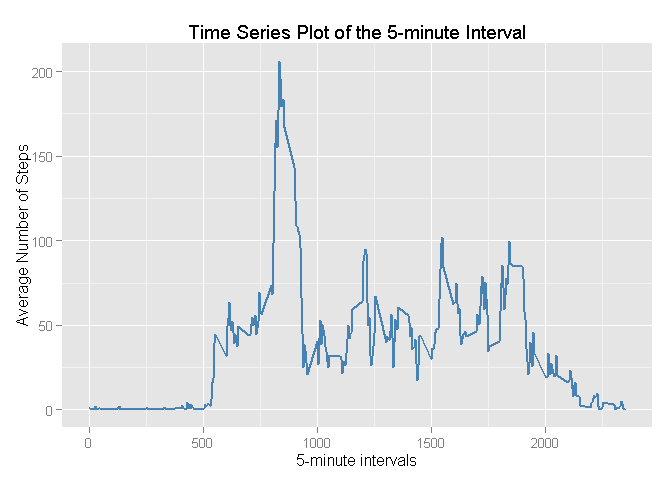
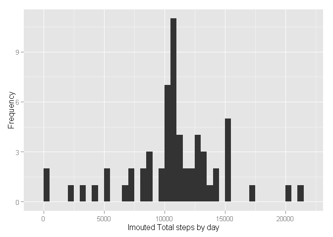
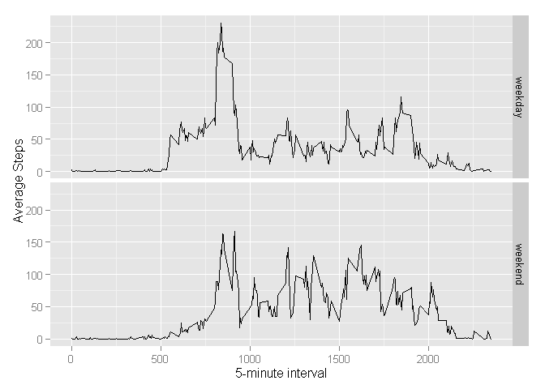

# Reproducible Research: Peer Assessment 1
## Environment Setup

```r
echo = TRUE  # so that someone else will be able to read the code
library(ggplot2)
library(scales)
```
## Loading and preprocessing the data
#### 1.Load the data (i.e. read.csv())

```r
if(!file.exists('activity.csv')){
unzip('repdata_data_activity.zip')
}
readActivityData <- read.csv('activity.csv')
```
#### 2.Process/transform the data (if necessary) into a format suitable for your analysis

```r
# remove incomplete cases
activityDataNoNA <- na.omit(readActivityData)
```
## What is mean total number of steps taken per day?
#### 1.Calculate the total number of steps taken per day

```r
ttlSteps <- tapply(activityDataNoNA$steps, list(Date = activityDataNoNA$date), sum, na.rm=TRUE)
ttlSteps
```

```
## Date
## 2012-10-01 2012-10-02 2012-10-03 2012-10-04 2012-10-05 2012-10-06 
##         NA        126      11352      12116      13294      15420 
## 2012-10-07 2012-10-08 2012-10-09 2012-10-10 2012-10-11 2012-10-12 
##      11015         NA      12811       9900      10304      17382 
## 2012-10-13 2012-10-14 2012-10-15 2012-10-16 2012-10-17 2012-10-18 
##      12426      15098      10139      15084      13452      10056 
## 2012-10-19 2012-10-20 2012-10-21 2012-10-22 2012-10-23 2012-10-24 
##      11829      10395       8821      13460       8918       8355 
## 2012-10-25 2012-10-26 2012-10-27 2012-10-28 2012-10-29 2012-10-30 
##       2492       6778      10119      11458       5018       9819 
## 2012-10-31 2012-11-01 2012-11-02 2012-11-03 2012-11-04 2012-11-05 
##      15414         NA      10600      10571         NA      10439 
## 2012-11-06 2012-11-07 2012-11-08 2012-11-09 2012-11-10 2012-11-11 
##       8334      12883       3219         NA         NA      12608 
## 2012-11-12 2012-11-13 2012-11-14 2012-11-15 2012-11-16 2012-11-17 
##      10765       7336         NA         41       5441      14339 
## 2012-11-18 2012-11-19 2012-11-20 2012-11-21 2012-11-22 2012-11-23 
##      15110       8841       4472      12787      20427      21194 
## 2012-11-24 2012-11-25 2012-11-26 2012-11-27 2012-11-28 2012-11-29 
##      14478      11834      11162      13646      10183       7047 
## 2012-11-30 
##         NA
```
#### 2.Make a histogram of the total number of steps taken each day

```r
qplot(ttlSteps, xlab='Total steps per day', ylab='Frequency', binwidth=500)
```

 

```r
ttlSteps
```

```
## Date
## 2012-10-01 2012-10-02 2012-10-03 2012-10-04 2012-10-05 2012-10-06 
##         NA        126      11352      12116      13294      15420 
## 2012-10-07 2012-10-08 2012-10-09 2012-10-10 2012-10-11 2012-10-12 
##      11015         NA      12811       9900      10304      17382 
## 2012-10-13 2012-10-14 2012-10-15 2012-10-16 2012-10-17 2012-10-18 
##      12426      15098      10139      15084      13452      10056 
## 2012-10-19 2012-10-20 2012-10-21 2012-10-22 2012-10-23 2012-10-24 
##      11829      10395       8821      13460       8918       8355 
## 2012-10-25 2012-10-26 2012-10-27 2012-10-28 2012-10-29 2012-10-30 
##       2492       6778      10119      11458       5018       9819 
## 2012-10-31 2012-11-01 2012-11-02 2012-11-03 2012-11-04 2012-11-05 
##      15414         NA      10600      10571         NA      10439 
## 2012-11-06 2012-11-07 2012-11-08 2012-11-09 2012-11-10 2012-11-11 
##       8334      12883       3219         NA         NA      12608 
## 2012-11-12 2012-11-13 2012-11-14 2012-11-15 2012-11-16 2012-11-17 
##      10765       7336         NA         41       5441      14339 
## 2012-11-18 2012-11-19 2012-11-20 2012-11-21 2012-11-22 2012-11-23 
##      15110       8841       4472      12787      20427      21194 
## 2012-11-24 2012-11-25 2012-11-26 2012-11-27 2012-11-28 2012-11-29 
##      14478      11834      11162      13646      10183       7047 
## 2012-11-30 
##         NA
```

#### 3.Calculate and report the mean and median of the total number of steps taken per day


```r
Steps <- aggregate(readActivityData$steps, list(readActivityData$date), sum)
Steps
```

```
##       Group.1     x
## 1  2012-10-01    NA
## 2  2012-10-02   126
## 3  2012-10-03 11352
## 4  2012-10-04 12116
## 5  2012-10-05 13294
## 6  2012-10-06 15420
## 7  2012-10-07 11015
## 8  2012-10-08    NA
## 9  2012-10-09 12811
## 10 2012-10-10  9900
## 11 2012-10-11 10304
## 12 2012-10-12 17382
## 13 2012-10-13 12426
## 14 2012-10-14 15098
## 15 2012-10-15 10139
## 16 2012-10-16 15084
## 17 2012-10-17 13452
## 18 2012-10-18 10056
## 19 2012-10-19 11829
## 20 2012-10-20 10395
## 21 2012-10-21  8821
## 22 2012-10-22 13460
## 23 2012-10-23  8918
## 24 2012-10-24  8355
## 25 2012-10-25  2492
## 26 2012-10-26  6778
## 27 2012-10-27 10119
## 28 2012-10-28 11458
## 29 2012-10-29  5018
## 30 2012-10-30  9819
## 31 2012-10-31 15414
## 32 2012-11-01    NA
## 33 2012-11-02 10600
## 34 2012-11-03 10571
## 35 2012-11-04    NA
## 36 2012-11-05 10439
## 37 2012-11-06  8334
## 38 2012-11-07 12883
## 39 2012-11-08  3219
## 40 2012-11-09    NA
## 41 2012-11-10    NA
## 42 2012-11-11 12608
## 43 2012-11-12 10765
## 44 2012-11-13  7336
## 45 2012-11-14    NA
## 46 2012-11-15    41
## 47 2012-11-16  5441
## 48 2012-11-17 14339
## 49 2012-11-18 15110
## 50 2012-11-19  8841
## 51 2012-11-20  4472
## 52 2012-11-21 12787
## 53 2012-11-22 20427
## 54 2012-11-23 21194
## 55 2012-11-24 14478
## 56 2012-11-25 11834
## 57 2012-11-26 11162
## 58 2012-11-27 13646
## 59 2012-11-28 10183
## 60 2012-11-29  7047
## 61 2012-11-30    NA
```

```r
meanSteps <- mean(Steps$x, na.rm = TRUE)
meanSteps
```

```
## [1] 10766.19
```

```r
medianSteps <- median(Steps$x, na.rm = TRUE)
medianSteps
```

```
## [1] 10765
```

## What is the average daily activity pattern?
#### 1.Make a time series plot (i.e. type = "l") of the 5-minute interval (x-axis) and the average number of steps taken, averaged across all days (y-axis)

```r
avgSteps <- aggregate(activityDataNoNA$steps, list(interval = as.numeric(as.character(activityDataNoNA$interval))), FUN = "mean")
names(avgSteps)[2] <- "meanOfSteps"

ggplot(avgSteps, aes(interval, meanOfSteps)) + geom_line(color = "steelblue", size = 0.8) + labs(title = "Time Series Plot of the 5-minute Interval", x = "5-minute intervals", y = "Average Number of Steps")
```

 

#### 2.Which 5-minute interval, on average across all the days in the dataset, contains the maximum number of steps?

```r
avgSteps[avgSteps$meanOfSteps == max(avgSteps$meanOfSteps), ]
```

```
##     interval meanOfSteps
## 104      835    206.1698
```
## Imputing missing values
#### Note that there are a number of days/intervals where there are missing values (coded as NA). The presence of missing days may introduce bias into some calculations or summaries of the data.
#### 1.Calculate and report the total number of missing values in the dataset (i.e. the total number of rows with NAs)

```r
sum(is.na(readActivityData))
```

```
## [1] 2304
```
#### 2.Devise a strategy for filling in all of the missing values in the dataset. The strategy does not need to be sophisticated. For example, you could use the mean/median for that day, or the mean for that 5-minute interval, etc
#### 3.Create a new dataset that is equal to the original dataset but with the missing data filled in

```r
stepValues <- data.frame(readActivityData$steps)
stepValues[is.na(stepValues),] <- ceiling(tapply(X=readActivityData$steps,INDEX=readActivityData$interval,FUN=mean,na.rm=TRUE))
activityDataImputed <- cbind(stepValues, readActivityData[,2:3])
colnames(activityDataImputed) <- c("steps", "date", "interval")
```
#### 4.Make a histogram of the total number of steps taken each day and Calculate and report the mean and median total number of steps taken per day. Do these values differ from the estimates from the first part of the assignment? What is the impact of imputing missing data on the estimates of the total daily number of steps?
##### Make a histogram of the total number of steps taken each day

```r
newDailyStepSum <- tapply(activityDataImputed$steps, activityDataImputed$date, sum)
qplot(newDailyStepSum, xlab='Imouted Total steps by day', ylab='Frequency', binwidth=500)
```

 

##### Calculate and report the mean total number of steps taken per day

```r
newTtlSteps <- tapply(activityDataImputed$steps, list(Date = activityDataImputed$date), sum)
newMean <- mean(newTtlSteps)
newMean
```

```
## [1] 10784.92
```

##### Calculate and report the median total number of steps taken per day

```r
newMedian <- median(newTtlSteps)
newMedian
```

```
## [1] 10909
```

##### Do these values differ from the estimates from the first part of the assignment

```r
oldMean <- meanSteps
oldMedian <- medianSteps
newMean - oldMean
```

```
## [1] 18.72935
```

```r
newMedian - oldMedian
```

```
## [1] 144
```
## Are there differences in activity patterns between weekdays and weekends?
#### For this part the weekdays() function may be of some help here. Use the dataset with the filled-in missing values for this part.
#### 1.Create a new factor variable in the dataset with two levels weekdays and weekends indicating whether a given date is a weekday or weekend day

```r
activityDataImputed$dateType <-  ifelse(as.POSIXlt(activityDataImputed$date)$wday %in% c(0,6), 'weekend', 'weekday')
```

##### 2.Make a panel plot containing a time series plot (i.e. type = "l") of the 5-minute interval (x-axis) and the average number of steps taken, averaged across all weekday days or weekend days (y-axis).


```r
averagedActivityDataImputed <- aggregate(steps ~ interval + dateType, data=activityDataImputed, mean)
ggplot(averagedActivityDataImputed, aes(interval, steps)) + 
    geom_line() + 
    facet_grid(dateType ~ .) +
    xlab("5-minute interval") + 
    ylab("Average Steps")
```

 
